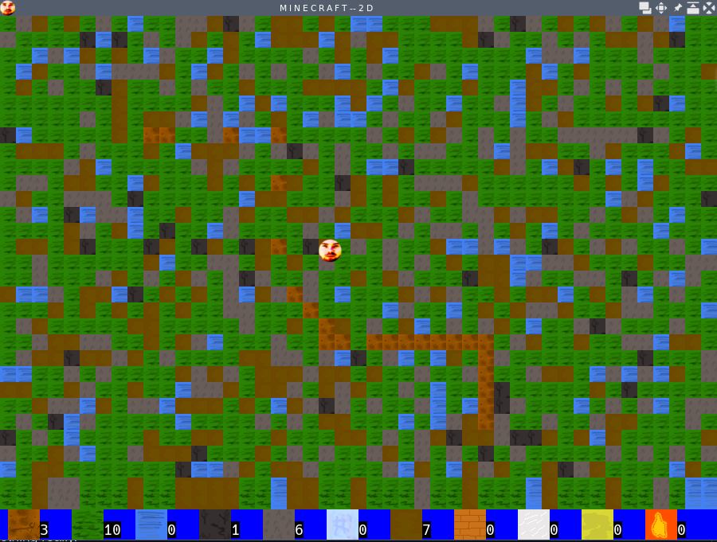

# A pygame game.
A simple "minecraft" like game using the gaming library pygame.

### FEATURING:

- My face as the main character.
- Different tiles to collect.
- No walls.
- Nothing really.

I'm unsure what tutorial I followed to construct this. It's a neat introduction to game loops though.

### Example


### Install
```bash
python3 -m venv venv
source venv/bin/activate
pip install pygame
python3 myFirst.py 
```

